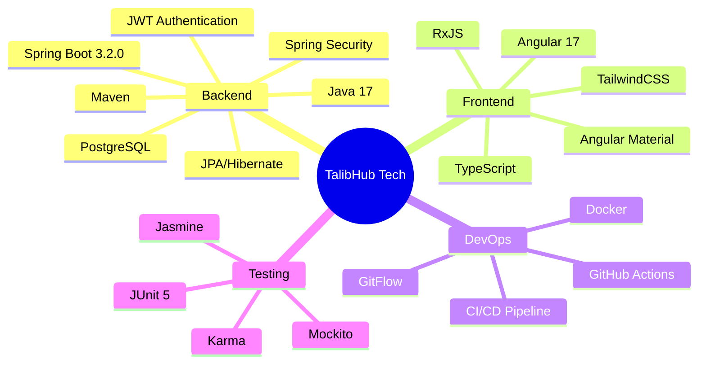
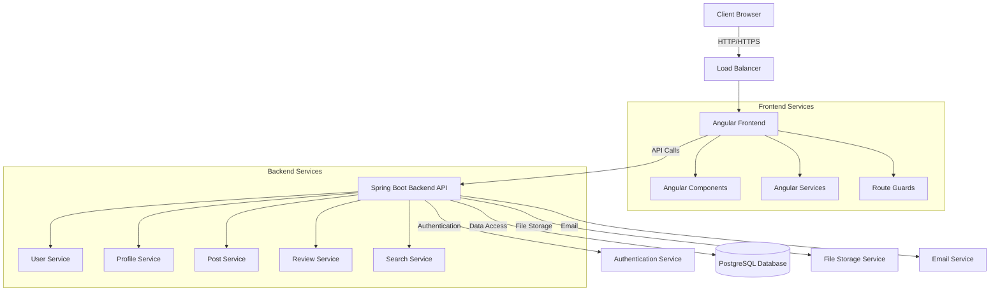
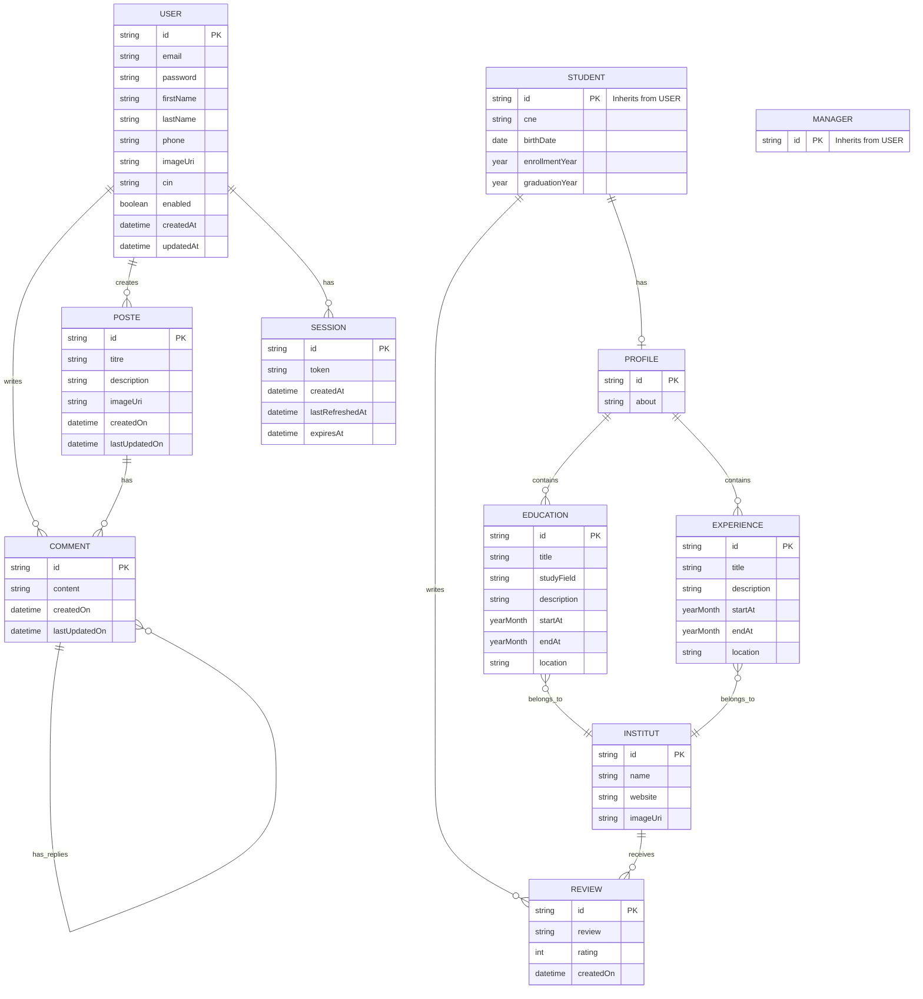
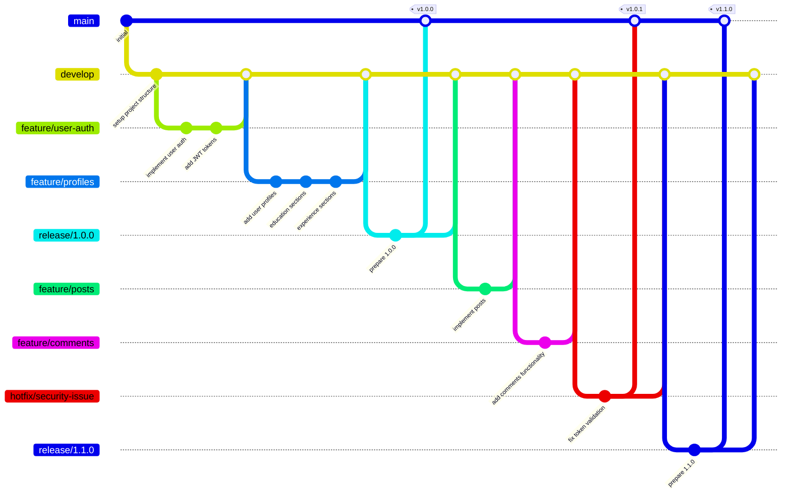
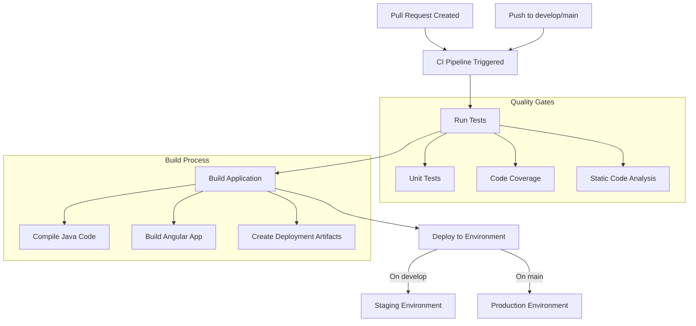
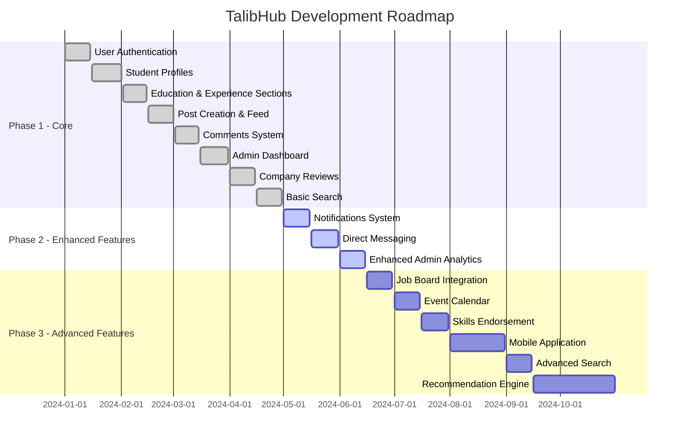

# TalibHub

<div align="center">
  
  <h3>A Digital Academic Social Network for Student Professionals</h3>
</div>

## 📚 Table of Contents
- [Overview](#overview)
- [Features](#features)
- [Technologies](#technologies)
- [Architecture](#architecture)
- [Screenshots](#screenshots)
- [GitFlow Methodology](#gitflow-methodology)
- [Project Backlog](#project-backlog)
- [Installation & Setup](#installation--setup)
- [Team](#team)

## 🌟 Overview

TalibHub is a comprehensive digital platform designed specifically for university students and graduates. It serves as a professional social network where students can build their academic and professional profile, share experiences, connect with companies, and access job opportunities.

The platform creates a bridge between academic institutions and businesses, enabling students to showcase their skills while providing companies with access to talented candidates.

## ✨ Features

### 👤 User Profiles
- Professional profile creation with personal information
- Academic history and achievements
- Work experience and internships
- Skills and certifications
- Portfolio showcasing projects

### 🏢 Company Reviews
- Rate and review companies where students have interned or worked
- View detailed company profiles with overall ratings
- Read experiences from peers who worked at specific companies

### 💬 Social Feed
- Share posts and updates
- Engage with content through comments
- Stay updated with academic and professional news

### 🔍 Search Functionality
- Find other students by name, skills, or institution
- Discover companies and their reviews
- Search through posts and content

### 👨‍💼 Admin Features
- User management through CSV imports
- Account activation and moderation
- Platform analytics and reporting

## 🛠️ Technologies



## 🏗️ Architecture

TalibHub follows a clean, modern architecture with clear separation of concerns:

```
├── Backend (Spring Boot)
│   ├── Controllers - API endpoints
│   ├── Services - Business logic
│   ├── Models - Data entities
│   ├── Repositories - Data access
│   ├── DTOs - Data transfer objects
│   ├── Security - Authentication & authorization
│   └── Config - Application configuration
│
├── Frontend (Angular)
│   ├── Components - UI elements
│   ├── Services - Backend communication
│   ├── Models - Data structures
│   ├── Pages - Screen layouts
│   ├── Guards - Route protection
│   └── Interceptors - HTTP request handling
```

### System Architecture Diagram



### Database Schema



## 📸 Screenshots

### Key Application Views

The application consists of several key screens that provide the core functionality:

1. **Login Page**: Secure authentication with email and password
2. **Home Feed**: Social posts from connections and educational institutions
3. **Student Profile**: Comprehensive view of academic and professional information
4. **Company Reviews**: Ratings and feedback for employers
5. **Admin Dashboard**: User management and platform administration

Screenshots will be added as the application development progresses. The current UI follows a clean, modern design with the TalibHub color scheme.

## 🔀 GitFlow Methodology

The TalibHub project follows the GitFlow workflow model to ensure structured development and deployment:



### Branch Structure

- **`main`**: Production-ready code, always stable
- **`develop`**: Integration branch for features, serves as the pre-production environment
- **`feature/*`**: Individual feature development branches
- **`release/*`**: Branches for release preparation
- **`hotfix/*`**: Emergency bug fixes for production issues

### Development Workflow

1. **Feature Development**:
   - Create a feature branch from `develop`: `git checkout -b feature/new-feature develop`
   - Implement changes with regular commits
   - When complete, merge back to `develop`: 
     ```
     git checkout develop
     git merge --no-ff feature/new-feature
     git push origin develop
     ```

2. **Release Preparation**:
   - Create a release branch when ready: `git checkout -b release/1.0.0 develop`
   - Prepare the release (version bumps, last fixes)
   - Merge to both `main` and `develop` when ready:
     ```
     git checkout main
     git merge --no-ff release/1.0.0
     git tag -a 1.0.0
     git checkout develop
     git merge --no-ff release/1.0.0
     ```

3. **Hotfixes**:
   - For production issues, create a hotfix branch: `git checkout -b hotfix/bug-fix main`
   - Implement the fix
   - Merge to both `main` and `develop`:
     ```
     git checkout main
     git merge --no-ff hotfix/bug-fix
     git tag -a 1.0.1
     git checkout develop
     git merge --no-ff hotfix/bug-fix
     ```

### CI/CD Pipeline

The project uses GitHub Actions for continuous integration and deployment, with separate workflows for the backend and frontend components.



## 📋 Project Backlog



### Feature Status

#### Completed ✅
- User authentication and authorization system
- Student profile creation and management
- Education and experience sections for profiles
- Post creation and feed display
- Comments on posts
- Admin dashboard for student management
- Company reviews system
- Search functionality for students

#### In Progress 🔄
- Notifications system
- Direct messaging between users
- Enhanced analytics for admins

#### Planned 📌
- Job board integration
- Event calendar
- Skills endorsement system
- Mobile application
- Advanced search with filters
- Recommendation engine

## 🚀 Installation & Setup

### Prerequisites
- Java 17
- Node.js 16+
- PostgreSQL
- Maven

### Backend Setup

```bash
# Clone the repository
git clone https://github.com/yourusername/talibhub.git
cd talibhub

# Navigate to backend directory
cd backend

# Install dependencies and build
mvn clean install

# Run the application
mvn spring-boot:run
```

### Frontend Setup

```bash
# Navigate to frontend directory
cd ../frontend

# Install dependencies
npm install

# Run the application
ng serve
```

The application will be available at:
- Frontend: http://localhost:4200
- Backend API: http://localhost:8081

### Docker Setup (Alternative)

```bash
# Build and run with Docker Compose
docker-compose up -d
```

## 👥 Team

### Contributors

- **Walid Ahdouf**: [Walid Ahdouf](https://github.com/w0l1d)
- **Abderrahman AITRAIS**: [Abderrahmane Ait Rais](https://github.com/AbdoAitrais)
- **Anas KABILA**: [Anas KABILA](https://github.com/KABILA-Anas)
- **Yassine JRAYFY**: [YASSINE Jrayfy](https://github.com/YASSINEJR3)


The team follows a collaborative approach where each member contributes across different aspects of the project while maintaining their area of expertise.

---

<div align="center">
  <p>© 2025 TalibHub Team. All rights reserved.</p>
</div>


==================================================
